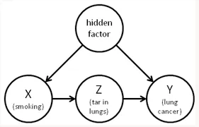

## Learnig About Causality

Let's start from the basics - what is a _cause_ and what is an _effect_? A **cause** is something that makes something else happen. An **effect** is what happens due to the cause. For example, if you turn on a switch (the cause), the light bulb illuminates (the effect).

Now, in the real world, there are numerous causes and effects happening all around us, influencing each other in complex ways. Causal modeling helps us make sense of these relationships by creating diagrams that represent the causes and effects as variables connected by arrows.

### Causal Diagrams and Models:

Imagine you have a bucket of Lego bricks, and each brick represents a different variable - an event, object, or characteristic. By arranging the bricks and connecting them with arrows, you can build a causal diagram, like a miniature model of the real-world situation.

For instance, let's model the factors that contribute to **lung cancer**. We might have bricks for "**smoking**," "**genetics**" (a hidden factor we can't directly see), and "**lung cancer**." By connecting them with arrows, we can represent that both smoking and genetics can potentially cause lung cancer.

### Subjectivity of Causal Models:
Now, here's an important thing to understand: these causal diagrams are subjective representations created by intelligent minds based on their perception and understanding of the situation. It's like different people building different Lego models from the same set of bricks.
{polymorphism}
### Interventions and Counterfactuals:
With our causal model, we can ask two types of questions: _interventional_ and _counterfactual_.

_Interventional_ questions involve changing one variable (like a switch) and seeing how it affects another. For example, "If we encourage people to quit smoking, how much would that reduce lung cancer rates?"

_Counterfactual_ questions are "what-if" scenarios about specific situations. For instance, "If this particular patient hadn't smoked, would they have developed lung cancer?"

### Correlation vs. Causation:
Merely seeing two events happen together doesn't necessarily mean one caused the other. This is where causal reasoning becomes crucial. For example, ice cream sales and drowning incidents are correlated (they happen together more often in summer), but ice cream doesn't cause drownings. Both are influenced by hot weather, which is the real cause.

### Causal Reasoning for Decision-Making:
By understanding the underlying causal mechanisms, we can make better decisions. If we know the key factors influencing **student performance**, we can decide whether reducing class sizes, improving teaching methods, or providing better nutrition would be more effective in boosting academic achievement.

### Role of Causal Modeling in Research:
Causal modeling should be done before conducting experiments or analyzing data. It helps guide the research process, identify confounding factors that need to be controlled for, and correctly interpret the results.

For instance, observational studies alone may not give us the full picture of causal effects due to unmeasured or unobserved factors. By building a causal model first, we can determine which variables need to be controlled or adjusted for to estimate the true causal effect.

### Controlling for Variables and the Back-door Criterion:
When estimating causal effects from data, we can't just control for every possible variable – that could actually introduce new biases. Instead, we need to identify a minimal set of variables that "blocks" all alternative causal paths between the variables of interest, satisfying what's called the "**back-door criterion**."

### Inducing Causal Relationships from Data:
While causal relationships can be hypothesized from data patterns, causal modeling is necessary to robustly answer interventional and counterfactual questions. Data mining and statistics alone can't fully capture the underlying causal mechanisms.

### Potential of Big Data:
The rise of **big data** provides opportunities for causal modeling and inference. With large datasets, we can search for interesting patterns, perform more precise analysis, overcome statistical limitations, and personalize interventions based on individual characteristics.

### Mediation Analysis and Counterfactuals:
Sometimes, the effect of one variable on another is not direct but mediated through intermediate variables. **Mediation analysis** helps us understand these indirect pathways. Counterfactual reasoning is crucial here – we ask questions like, "If this patient's circumstances were different, would the outcome have changed?"

### The "Ladder of Causation":
Pearl organizes statistical, interventional, and counterfactual queries into a "**ladder of causation**," with counterfactual reasoning at the top rung. This ability to imagine alternative scenarios and understand their consequences is a hallmark of human intelligence and consciousness.

### Causal Reasoning and Ethical AI:
As we develop increasingly intelligent systems, causal reasoning becomes vital for them to understand the consequences of their actions and make ethical decisions. A **self-driving car**, for instance, needs to grasp the causal relationships between its actions (braking, accelerating) and potential outcomes (accidents, injuries) to make optimal choices.

### Cognitive Basis of Causal Models:
Interestingly, causal models may be stored in our minds as "_reference frames_" – cognitive structures that link concepts based on causal relationships like "causes" and "caused by." This could explain why human intuition is organized around causal, not just statistical, associations.

### Independent Causal Mechanisms:
Causal modeling assumes that the causal mechanisms linking variables are independent – changing one doesn't affect the others. This principle, while an assumption, often holds true in the real world and allows us to make targeted interventions without disrupting the entire system.

### Limitations in Complex Systems:
However, in highly complex systems where "everything depends on everything," the methods of causal inference may break down. In such cases, we may need to use alternative approaches like simulations to model and predict the system's behavior.
